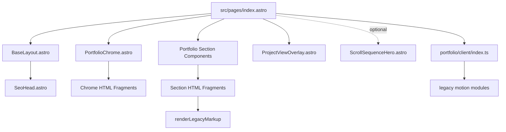

---
tags:
  - architecture
  - obsidian
type: map
---

# Project Map

## Runtime Shape

`src/pages/index.astro` composes the portfolio shell, chrome, homepage sections, optional scroll sequence hero, and project overlay inside `BaseLayout`.

## Knowledge Nodes

- [[nodes/astro-shell|Astro Shell]] covers layout, config, SEO head loading, and global CSS entry.
- [[nodes/portfolio-homepage|Portfolio Homepage]] covers the homepage assembly and section order.
- [[nodes/portfolio-chrome|Portfolio Chrome]] covers raw chrome fragments rendered outside main content.
- [[nodes/legacy-fragments|Legacy Fragments]] covers migrated HTML fragments and replacement tokens.
- [[nodes/motion-system|Motion System]] covers client-side interaction modules.
- [[nodes/scroll-sequence-hero|Scroll Sequence Hero]] covers the optional canvas frame sequence.
- [[nodes/project-content|Project Content]] covers Astro Content Collections.
- [[nodes/project-pages|Project Pages]] covers project detail routes and project components.
- [[nodes/styling-system|Styling System]] covers CSS layering and legacy cascade.
- [[nodes/seo-routing|SEO Routing]] covers sitemap, robots, canonical data, and metadata.
- [[nodes/quality-deployment|Quality And Deployment]] covers checks and production release flow.

## Context Boundaries

- Source of truth for structured project case studies is `src/content/projects`.
- Source of truth for major page visuals is currently split between Astro section wrappers and raw HTML fragments.
- Source of truth for global visual behavior is `src/features/portfolio/client`.
- Large generated media should be referenced by manifest or file count, not read directly.
