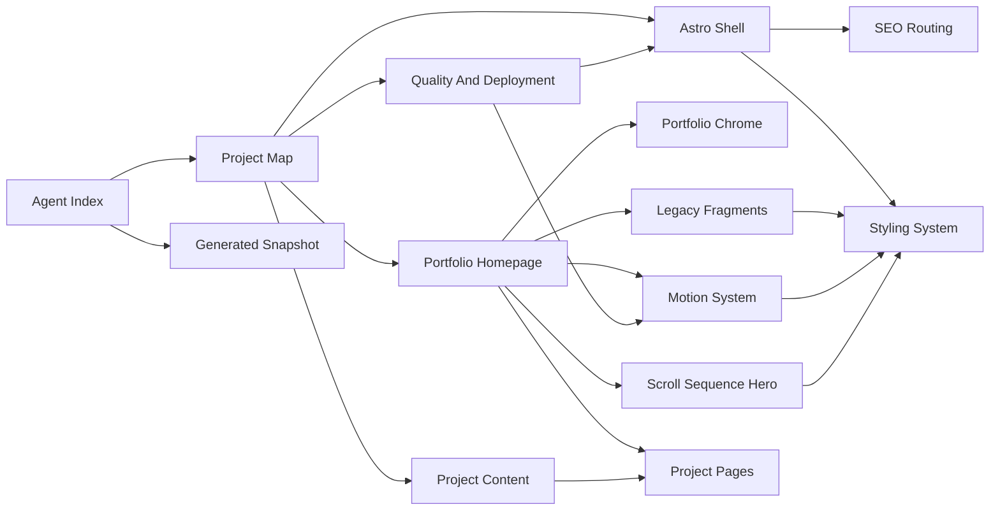

---
tags:
  - architecture
  - obsidian
type: graph
---

# Knowledge Graph

Use this map when Obsidian graph view is too dense.

## Linked Notes

[[00-agent-index|Agent Index]] links to every major node. Each node links back to this graph through related notes or via [[01-project-map|Project Map]].

## Machine-Readable Graph

The script writes `docs/knowledge/generated/knowledge-graph.json` for agents that prefer structured context.
